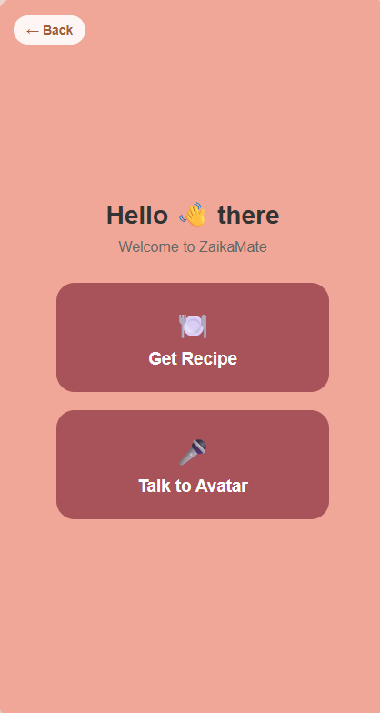
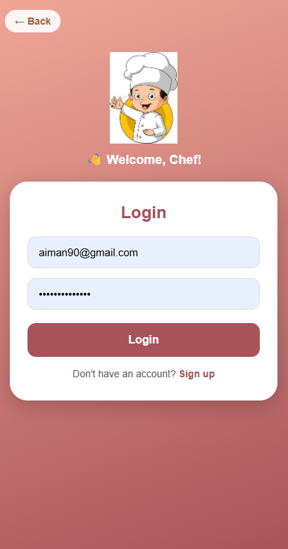
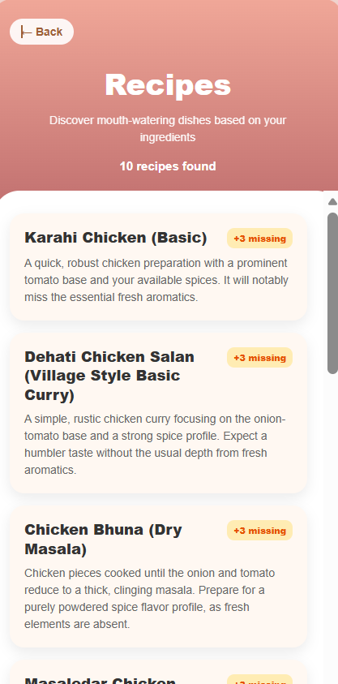
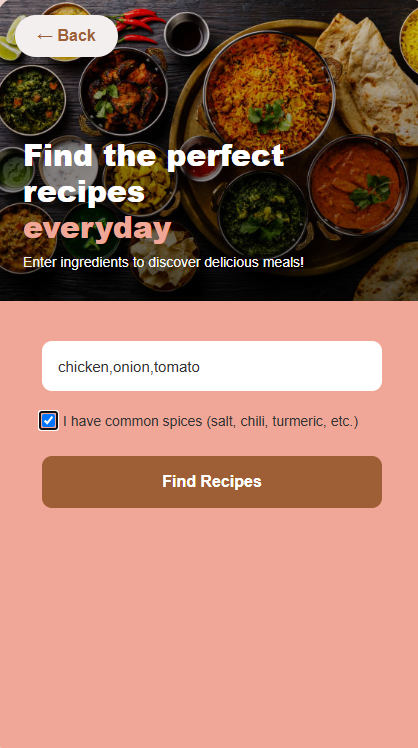
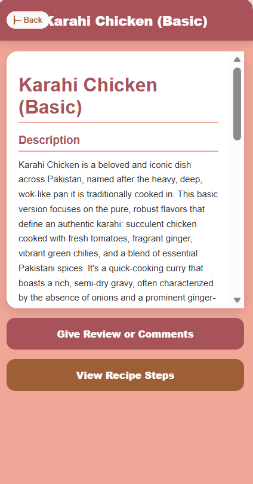
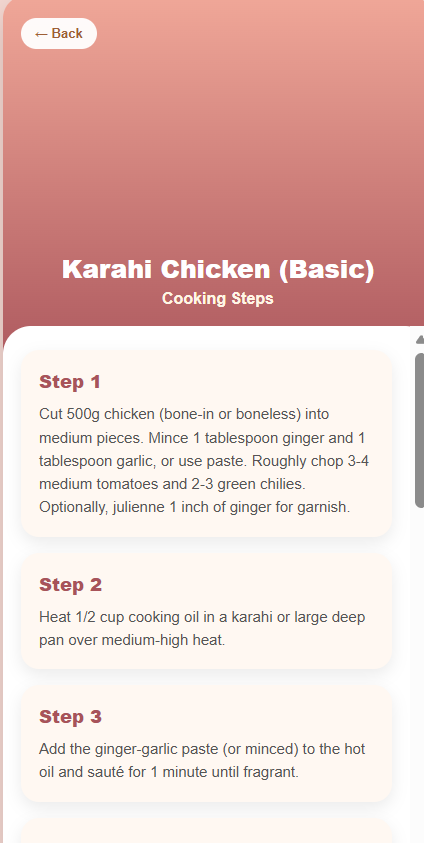
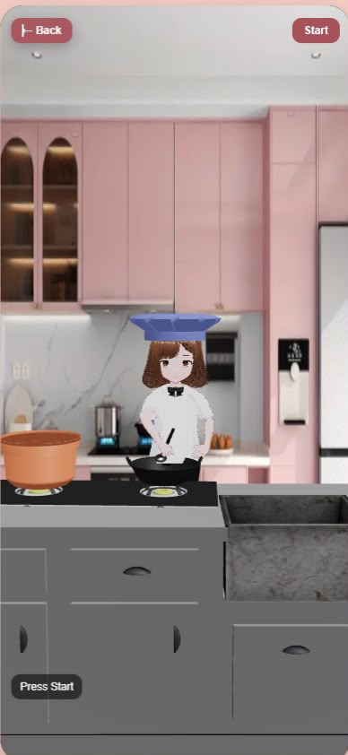

# 🍳 ZaikaMate — AI-Powered Cooking Assistant

> A smart recipe discovery web app featuring a **3D animated avatar**, real-time voice interaction, and personalized cooking guidance — built as a Final Year Project at FAST NUCES, Lahore.

---

## 📸 Screenshots

<table>
  <tr>
    <td align="center"><b>Home</b></td>
    <td align="center"><b>Login</b></td>
    <td align="center"><b>Main Screen</b></td>
  </tr>
  <tr>
     <td></td>
    <td></td>
    <td></td>
    <td></td>
  </tr>
  <tr>
    <td align="center"><b>Recipes</b></td>
    <td align="center"><b>Recipe Detail</b></td>
    <td align="center"><b>Chicken Karhai</b></td>
  </tr>
  <tr>
    <td></td>
    <td></td>
    <td></td>
  </tr>
  <tr>
    <td align="center"><b>Recipe Steps</b></td>
    <td align="center"><b>Reviews & Comments</b></td>
    <td align="center"><b>Avatar Screen</b></td>
  </tr>
  <tr>
    <td></td>
    <td></td>
    <td></td>
  </tr>
</table>

---

## ✨ Features

- 🤖 **3D VRM Avatar** — Animated cooking assistant with hat & spoon props built with Three.js and React Three Fiber
- 🎙️ **Real-time Voice** — LiveKit audio integration with ElevenLabs TTS-triggered lip-sync animations
- 🔍 **Recipe Discovery** — Search and browse recipes with detailed step-by-step instructions
- 👤 **Authentication** — Login / Signup with custom state-machine navigation pattern
- ⭐ **Reviews & Comments** — Rate and comment on recipes
- 🐍 **FastAPI Backend** — Python backend serving recipe data and AI features
- ⚡ **Vite + React** — Fast, modern frontend

---

## 🗂️ Project Structure

```
fyp-web/
├── src/                          # React frontend source
│   ├── components/               # Reusable UI components
│   ├── pages/                    # Page-level components
│   └── assets/                   # Images, models, fonts
├── public/                       # Static assets
├── backend/                      # LiveKit agent backend
│   ├── agent.py                  # LiveKit voice agent
│   └── main.py                   # Backend entry point
├── recipe_fastapi_backend/       # FastAPI recipe backend
│   └── main.py                   # FastAPI app entry point
├── index.html
├── vite.config.js
├── package.json
└── .env                          # (not committed) API keys
```

---

## 🚀 Getting Started

### Prerequisites

- Node.js v18+
- Python 3.10+
- LiveKit server (included as `livekit-server.exe`)

---

### 1️⃣ Clone the Repository

```bash
git clone https://github.com/Habibatariq24/ZaikaMate.git
cd ZaikaMate
```

---

### 2️⃣ Frontend — React + Vite

```bash
npm install
npm run dev
```

Runs at: `http://localhost:5173`

---

### 3️⃣ Recipe Backend — FastAPI

```bash
cd recipe_fastapi_backend
pip install -r requirements.txt
python main.py
```

---

### 4️⃣ LiveKit Agent Backend

```bash
cd backend
pip install -r requirements.txt
python main.py
```

Or run in dev mode:

```bash
cd backend
python agent.py dev
```

---

### 5️⃣ LiveKit Server (Windows)

```bash
./livekit-server.exe --dev
```

---

## 🔑 Environment Variables

Create a `.env` file in the project root and add the following:

```env
VITE_LIVEKIT_URL=ws://localhost:7880
LIVEKIT_API_KEY=your_livekit_api_key
LIVEKIT_API_SECRET=your_livekit_api_secret
ELEVEN_LABS_API_KEY=your_elevenlabs_api_key
```

> ⚠️ Never commit your `.env` file to GitHub! It is already listed in `.gitignore`.

---

## 🛠️ Tech Stack

| Layer | Technology |
|-------|------------|
| Frontend | React, Vite, JavaScript |
| 3D Avatar | Three.js, React Three Fiber, @pixiv/three-vrm |
| Voice & Audio | LiveKit, ElevenLabs TTS |
| Animation | VRM Spring Bone, custom stirring animations |
| Backend | FastAPI (Python) |
| Auth | JWT |
| Dev Tools | ESLint, Vite HMR |

---

## 🧠 How It Works

1. User opens the app and logs in via the **Login/Signup** screen
2. On the **Main Screen**, a 3D VRM avatar greets the user wearing a chef hat and holding a spoon
3. User can **search for recipes** — results are fetched from the FastAPI backend
4. Clicking a recipe shows **step-by-step instructions** with ingredients
5. The avatar **speaks instructions aloud** via ElevenLabs TTS through LiveKit
6. Avatar **animates (stirs)** in sync with TTS playback
7. Users can leave **reviews and comments** on recipes

---

## 👩‍💻 Author

**Habiba Tariq**  
Final Year Data Science Student — FAST NUCES, Lahore

---

## 📄 License

This project is licensed under the terms of the included LICENSE file.
